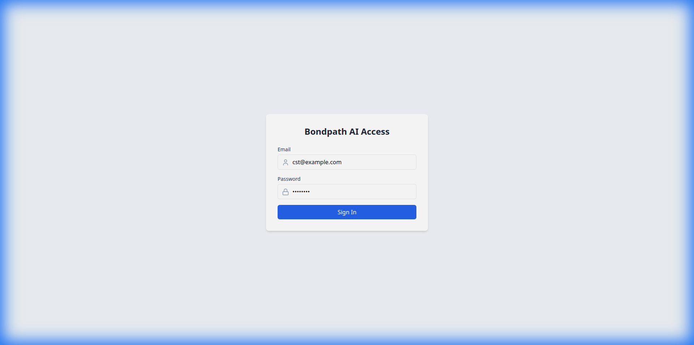
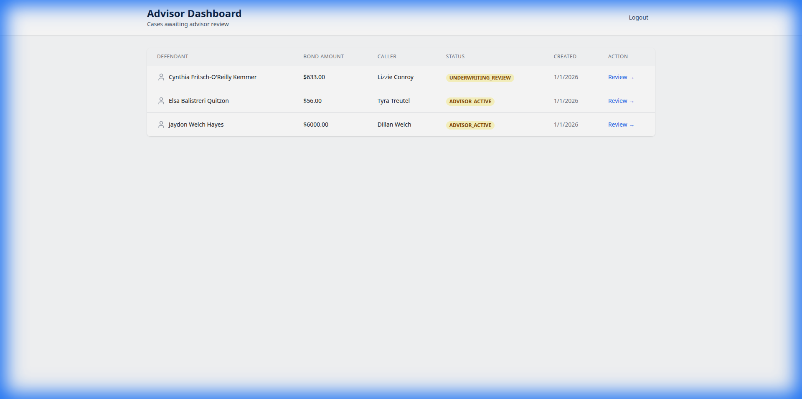
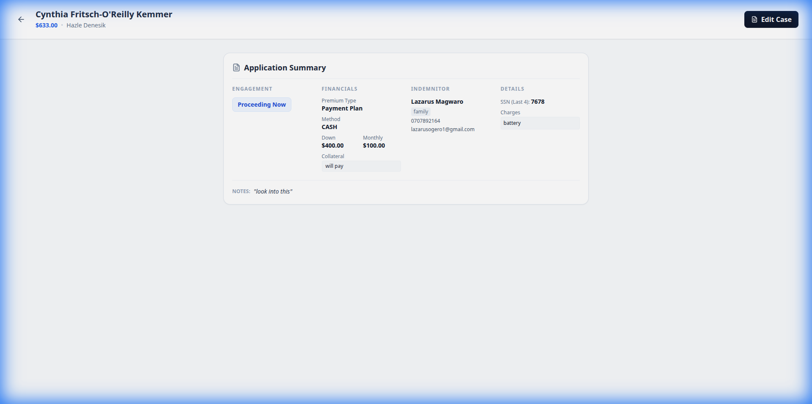

# Bondpath AI

Bondpath AI is an intelligent platform designed to revolutionize the insurance underwriting and case management process. By leveraging advanced AI agents, it streamlines workflows for Advisors, Customer Service Teams (CST), and Underwriters.

## 🚀 Key Features

-   **Role-Based Dashboards**: Tailored interfaces for Advisors, CST agents, and Underwriters to manage their specific workflows.
-   **AI-Powered Case Analysis**: Automated analysis of case documents to identify risks and provide actionable insights.
-   **Intelligent Document Verification**: AI agents verify uploaded documents for authenticity and completeness.
-   **Seamless Case Management**: End-to-end tracking of insurance applications from submission to approval.
-   **Secure Authentication**: Role-based access control ensuring data security and privacy.

## 📸 Screenshots

### Login Page
Secure access point for all users.


### Advisor Dashboard
A comprehensive view for Advisors to track their active cases and status.


### Case Details
In-depth view of a specific case, featuring AI-generated analysis and document status.


## 🛠️ Technology Stack

-   **Frontend**: React, TypeScript, Vite, Tailwind CSS
-   **Backend**: FastAPI, Python 3.12
-   **Database**: PostgreSQL / SQLite (for development), Pinecone (Vector DB)
-   **AI**: Multi-Agent System (LangGraph/LangChain concepts)

## ⚙️ Local Setup

1.  **Clone the repository**
    ```bash
    git clone https://github.com/Evan620/Bondpath-AI.git
    cd Bondpath-AI
    ```

2.  **Backend Setup**
    ```bash
    cd backend
    python -m venv venv
    source venv/bin/activate
    pip install -r requirements.txt
    python seed.py  # Initialize database with seed data
    uvicorn app.main:app --reload
    ```

3.  **Frontend Setup**
    ```bash
    cd frontend
    npm install
    npm run dev
    ```

4.  **Access the App**
    Open [http://localhost:5173](http://localhost:5173) in your browser.

## 📄 License

Bondpath AI is proprietary software. All rights reserved.
